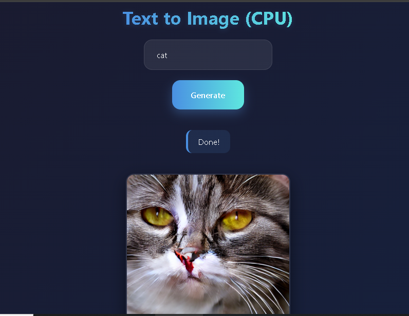

# 🖼️ Text to Image Generator (CPU Based)

A **Text-to-Image Generator** built using **FastAPI** and **Stable Diffusion**, designed to run **entirely on a normal PC (CPU)** without requiring a GPU.

This project converts a **text prompt** into an **AI-generated image** through a simple and clean web interface.

---

## 🚀 Project Highlights

- ✅ Runs on **CPU (Laptop / Desktop PC)**
- ❌ No GPU required
- 🧠 Powered by **Stable Diffusion**
- 🌐 FastAPI backend
- 🎨 Clean and responsive UI (HTML + CSS)
- 📦 Automatic model download (no manual setup)

---

## 🖥️ Why This Project is Suitable for a PC

Many AI image generators require powerful GPUs.  
This project is **optimized to run on a normal PC**, making it ideal for:

- Students
- College projects
- Low-end or mid-range laptops
- Learning AI + Web Development

### ⏱️ Performance Notes
- Image generation time: **2–5 minutes (CPU)**
- Reduced inference steps for faster results
- Stable and reliable execution on CPU

---

## 🧠 Model Information

- **Model Used:** Stable Diffusion v1.5  
- **Source:** Hugging Face (`runwayml/stable-diffusion-v1-5`)
- **Framework:** Diffusers + PyTorch
  
---

## 📸 Screenshots

### 🎨 Generated Image Output

## ▶️ How to Run the Project

1️⃣ Clone the Repository
git clone https://github.com/your-username/text-to-image-fastapi.git
cd text-to-image-fastapi
2️⃣ Create Virtual Environment
bash
Copy code
python -m venv venv
venv\Scripts\activate
3️⃣ Install Dependencies
bash
Copy code
pip install -r requirements.txt
4️⃣ Start the Server
bash
Copy code
uvicorn main:app --host 0.0.0.0 --port 8000
5️⃣ Open in Browser
arduino
Copy code
http://localhost:8000
📌 Important Notes
First run will take longer (model download)
CPU execution is slower than GPU (expected behavior)
Keep the server running while generating images

👨‍💻 Author

M.Mughira.Asad

